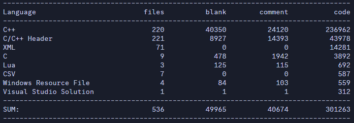

Hoo boy, this one is probably going to be a doozy. For those of you who haven't heard (which I assume is most or all of you), I contribute to an open-source addon called "NASSP" for the Orbiter space flight simulator program. This addon simulates the Apollo space program that landed humans on the moon in the 1960s and '70s. That is to say, it adds all the relevant space vehicles, including the Saturn 1B, Saturn V, Command and Service Module, Lunar Module, and even the tangentially-related Skylab orbital workshop, as well as the necessary logic to compute and fly the historical missions, or even plan one's own custom missions. It is intended to be a "study simulation": a simulation that is accurate and realistic enough that it can be used to study and learn about the spacecraft behavior, procedures, and mission profiles in as close to an academic manner as can be done with the information and technology available. We personally consider NASSP to be the single most accurate simulation of the Apollo program that currently exists. It's not perfect, but we strive to make it better every time we work on it. For each vessel, we have whole heaps of code which simulates the inner workings of the various systems and components inside the craft, including but not limited to: environmental control and life support; electrical power generation and distribution; cryogenic, gas, and liquid consumables; thermal control and heating/cooling; propulsion; and guidance, navigation, and computer subsystems. Orbiter, the simulator itself, handles the complex physics and aerodynamics of flight, and provides some help with loading and rendering assets like graphics, but pretty much all other computations and work is done by our code.

And good grief, how much code that requires! As I write this, there's approximately *300,000 lines of code*:

Yeah. It's pretty ridiculous. And while I haven't yet had the opportunity (or perhaps, displeasure?) to work on any serious legacy codebases in a professional capacity, I have to imagine this is remarkably close to what that's like, minus the deadlines and all the additional responsibilities that a real job would have. Anyway, the point of the matter is that NASSP's code is an almost unfathomably large pool that's had dozens of different contributors over the years since its inception in 2003. That's a lot of different programmers with different coding styles, different versions of the C++ language and its features, and different amounts of programming experience. Not to mention, the project had a lot more humble intentions when it first started. Only in the last 10 years or so has the focus really shifted towards all-out accuracy and attention to detail, helped in part by the gradual archival and scanning of original Apollo documents. As a result... things are messy. Really messy. So much of the foundational code and structure we use for processing and drawing visuals remains largely unchanged in over a decade. And consequently, with each new feature or system we add, the strain on the most archaic segments of code increases.

But if improving things were an easy task, it would have been done long ago. Not to mention: people far smarter and more accomplished than than me have made blog posts and articles about this kind of thing before. So, I'd like to focus on the areas I'm aware of where I think NASSP stands to benefit from reworking or refactoring.